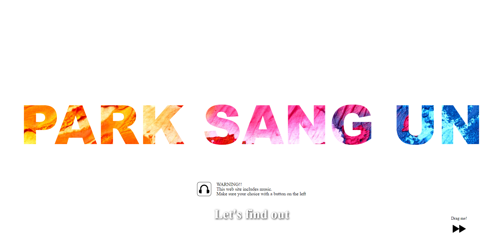
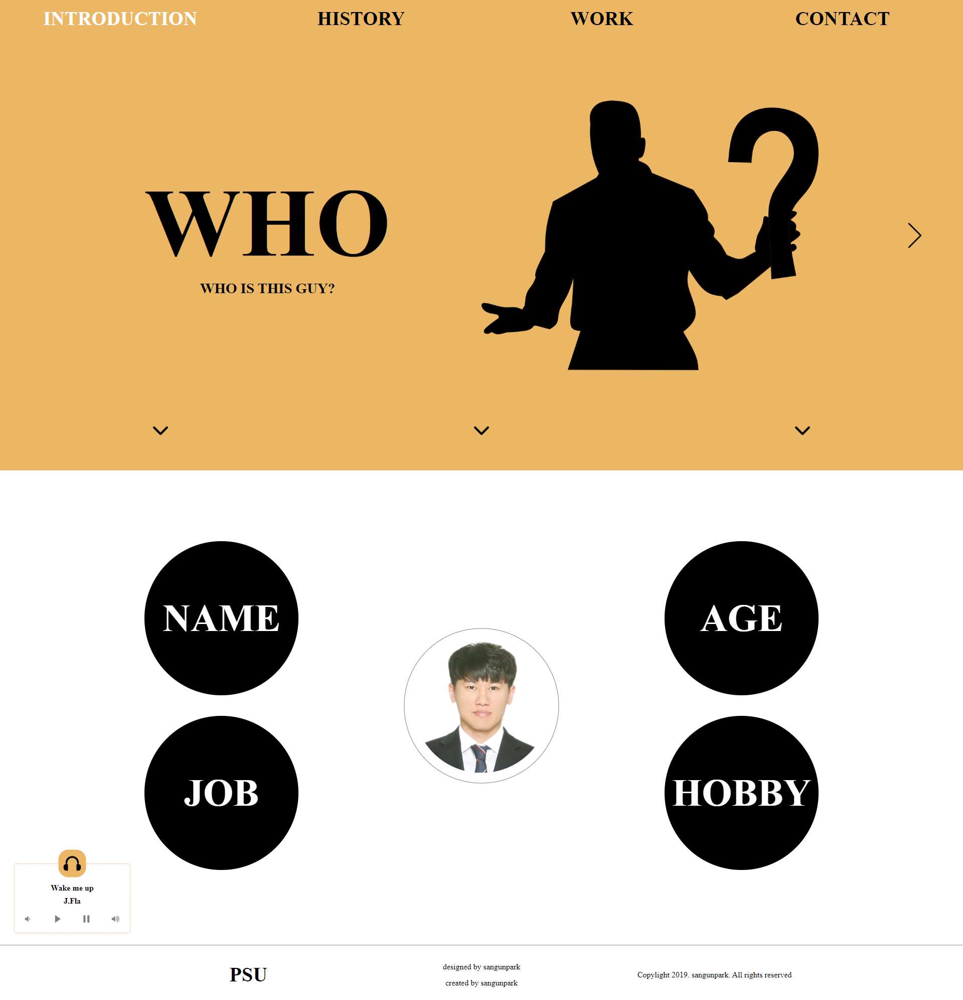
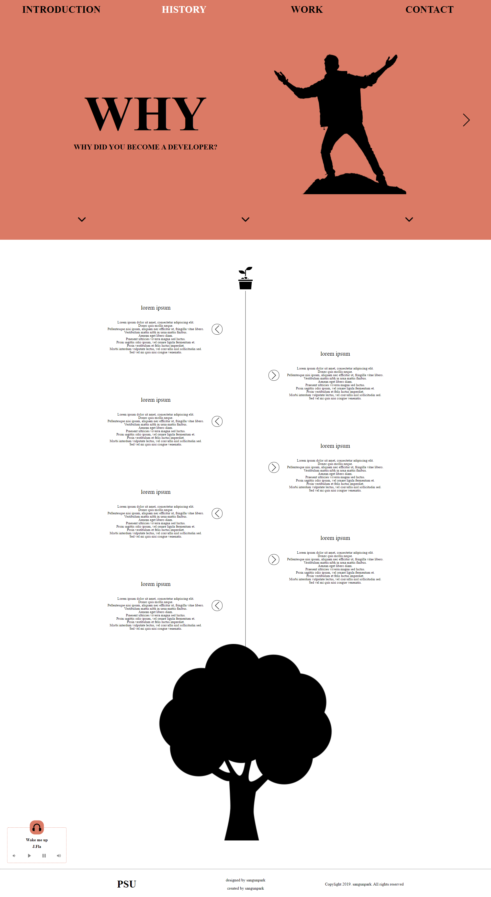
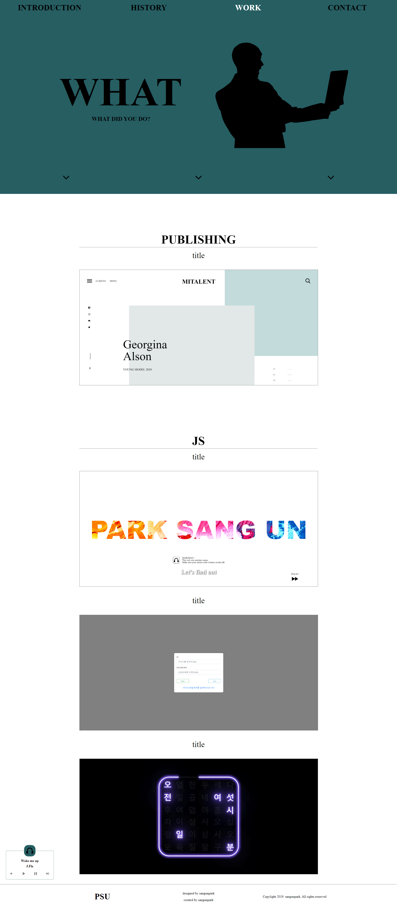
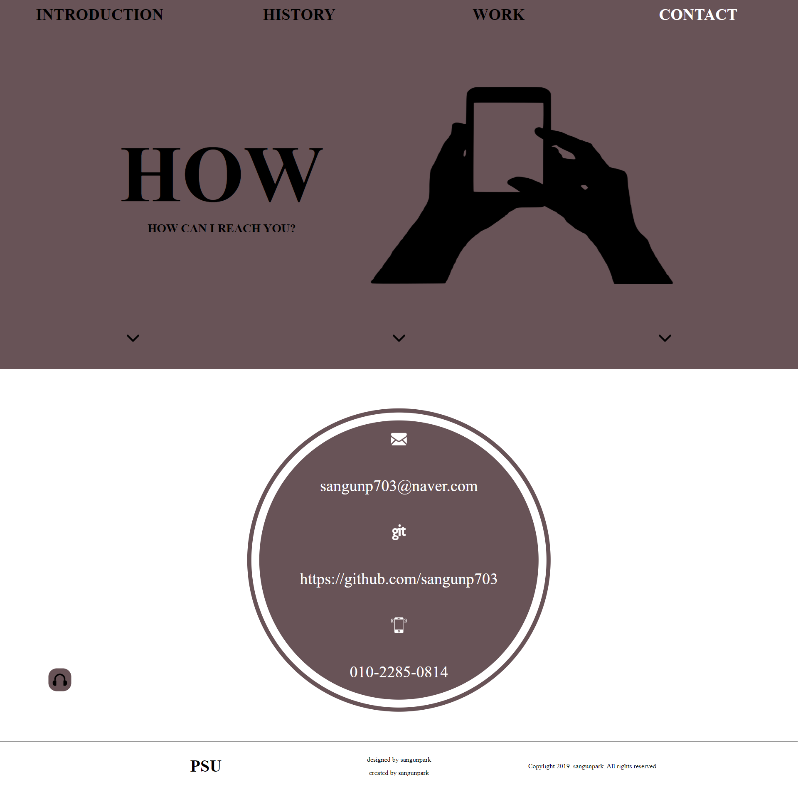

# PSU

React Router를 이용한 간단한 자기소개 페이지

## 사용기술

- React
- React Router
- webpack
- node.js Express

## 스크린샷

- intro
  
  왼쪽 하단의 빨리감기 버튼을 오른쪽으로 드래그하면 이름이 커지고 주의 사항 문구와 입장할 수 있는 버튼이 나타난다.

- 각 페이지 공통 
  왼쪽의 헤더 버튼이나 양 옆의 화살표로 다른 페이지로 이동 가능(화살표는 마우스를 호버하면 나타남) 
  왼쪽 하단의 고정된 음악플레이어를 이용하여 음악 조정 가능 

- introduction
  
  본문의 가운데 원을 클릭하면 얼굴이 나오고 클릭할 때 마다 드래그 가능한 정보 요소들이 나타남

- history
  
  본문의 새싹 그림을 클릭하면 트리가 그려지고 각 화살표를 클릭하면 내용을 볼 수 있다.

- work
  
  각 작업물에 마우스를 올려놓으면 간단한 내용 설명 
  클릭하면 각 작업물의 스크린샷을 볼 수있는 모달 생성

- contact
  
  연락처 및 Git주소를 알 수 있는 페이지
